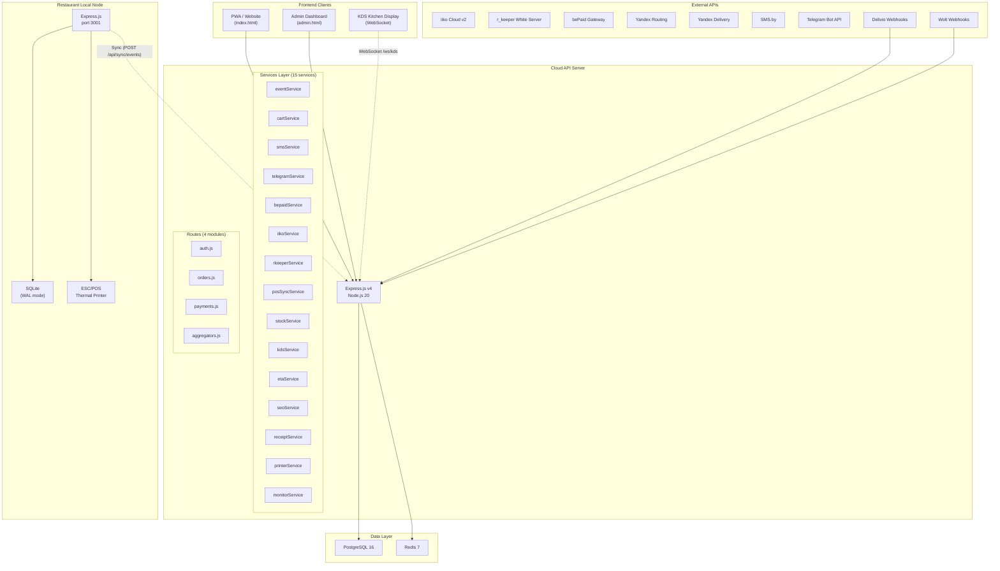
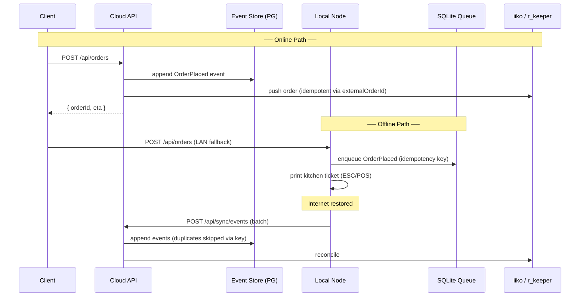
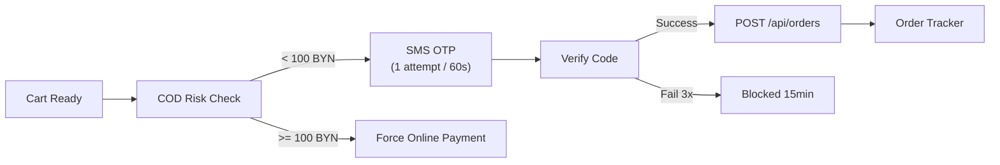
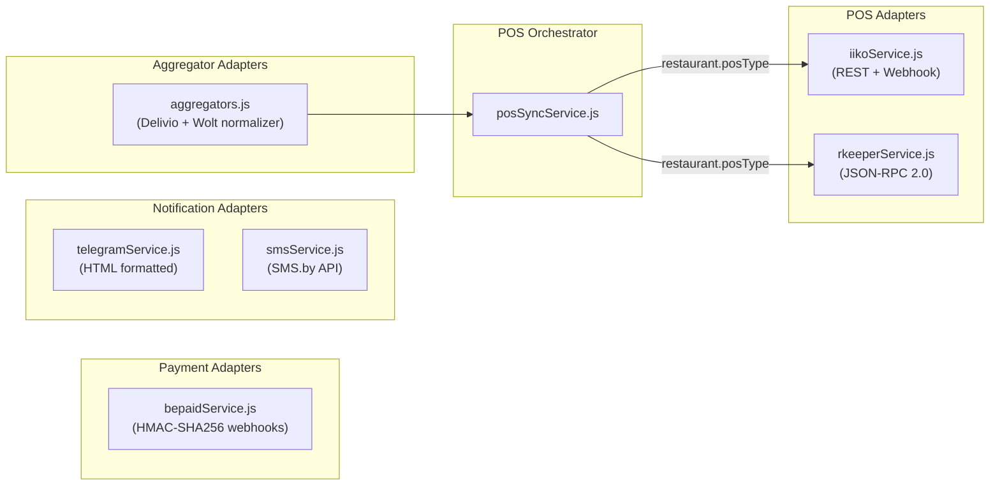
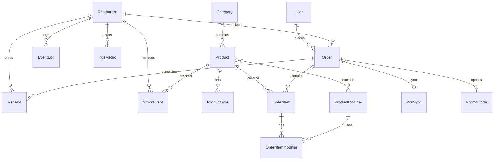

# Express Pizza — Technical Specification & Project Overview

> **Version:** 4.0 (SaaS Platform)
> **Last Updated:** 2026-03-10
> **Architecture:** Local-First, Event-Driven (Event Sourcing)
> **Status:** Backend coded, pending migration + deploy

---

## Table of Contents

1. [Project Overview & Business Goals](#1-project-overview--business-goals)
2. [System Architecture & Tech Stack](#2-system-architecture--tech-stack)
3. [Core Features — Client & Admin](#3-core-features--client--admin)
4. [Business Logic & Constraints](#4-business-logic--constraints)
5. [Integrations & Middleware](#5-integrations--middleware)
6. [Legal & Compliance (Republic of Belarus)](#6-legal--compliance-republic-of-belarus)
7. [File Map & Module Reference](#7-file-map--module-reference)
8. [Environment Variables](#8-environment-variables)
9. [Database Schema Reference](#9-database-schema-reference)
10. [API Endpoint Reference](#10-api-endpoint-reference)
11. [Deployment & Infrastructure](#11-deployment--infrastructure)

---

## 1. Project Overview & Business Goals

### 1.1 Product

**Express Pizza** is a Full-Stack FoodTech SaaS platform for a pizza delivery chain based in **Minsk, Belarus**. The system covers the entire lifecycle: customer-facing ordering website → server-side order processing → POS kitchen integration → delivery logistics → fiscal compliance.

### 1.2 Target Audience

| Segment | Description |
|---------|-------------|
| **Customers** | Minsk residents ordering pizza delivery (18–45 age, mobile-first) |
| **Restaurant staff** | Managers and kitchen operators using KDS and admin panel |
| **Couriers** | Delivery drivers receiving orders and route information |
| **Aggregator partners** | Delivio, Wolt — receiving orders via tablet-less webhooks |

### 1.3 Value Proposition

- **Dodo Pizza-level UX** — premium, mobile-first ordering experience
- **Offline resilience** — restaurants keep accepting orders even when internet drops
- **Multi-POS support** — works with both iiko Cloud and r_keeper simultaneously
- **Belarus compliance** — КБЖУ, allergens, UNP, public offer built-in
- **Aggregator tablet-less** — no tablets needed; webhooks auto-forward to POS

### 1.4 Development Phases

| Phase | Status | Focus |
|-------|--------|-------|
| Phase 1 | ✅ Done | Frontend MVP (HTML/CSS/JS, localStorage) |
| Phase 2 | ✅ Done | Secure cart (server-side pricing), JWT auth |
| Phase 3 | ✅ Done | bePaid payments, iiko v1, Telegram bot (server-side), legal footer |
| Phase 4 | ✅ Coded | Event Sourcing, iiko v2, r_keeper, KDS, ETA, receipts, Local Node, Docker |

---

## 2. System Architecture & Tech Stack

### 2.1 High-Level Architecture



### 2.2 Technology Stack

| Layer | Technology | Version | Purpose |
|-------|-----------|---------|---------|
| **Frontend** | HTML5 + Tailwind CSS + Vanilla JS | 3.x | Customer-facing SPA |
| **Admin** | HTML5 + Tailwind CSS + Inline JS | 3.x | Operator dashboard |
| **Backend** | Node.js + Express.js | 20 LTS / 4.x | API server |
| **ORM** | Prisma | 5.x | PostgreSQL schema + migrations |
| **Database** | PostgreSQL | 16 | Primary relational data store |
| **Cache/PubSub** | Redis | 7 | KDS real-time, ETA cache |
| **Local DB** | SQLite (better-sqlite3) | — | Offline event queue |
| **WebSocket** | ws | 8.x | KDS real-time push |
| **Containerization** | Docker + Docker Compose | — | Production deployment |

### 2.3 Architectural Pattern: Local-First Event Sourcing



**Key design decisions:**

| Decision | Choice | Rationale |
|----------|--------|-----------|
| Event Store | PG `event_log` table | Single DB, append-only, `sequence_num` for ordering |
| Offline queue | SQLite WAL | Fast, zero-config, survives power loss |
| Idempotency | UUID `idempotencyKey` + `externalOrderId` | Prevents duplicate orders across sync/POS |
| POS priority | Webhooks (push) over polling | Real-time, lower latency |
| Real-time KDS | WebSocket (`/ws/kds`) per restaurant | Low-latency order lifecycle updates |

---

## 3. Core Features — Client & Admin

### 3.1 Customer Website (`index.html` + `app.js`)

The customer-facing website is a single-page application (779 lines of JS) with the following capabilities:

#### 3.1.1 Menu & Product Display

| Feature | Implementation |
|---------|---------------|
| **Category tabs** | Pizza, Пицца TOGO, Соусы, Соки, Напитки |
| **Product cards** | Image, name, description, price range, badge (Хит, Новинка, 🔥 Острая) |
| **Multi-size selection** | Radio buttons per product (e.g. 30 см / 36 см / 60 см) |
| **Modifier selection** | Checkboxes: Сырный бортик (+4₽), Халапеньо (+1.5₽), Без лука (0₽) |
| **КБЖУ display** | Calories, proteins, fats, carbs per 100g on each product |
| **Allergen badges** | Emoji + text labels from 14-allergen registry |
| **Skeleton loaders** | Show placeholders during data load |
| **Empty state** | Illustrated message when category has no products |
| **Dark mode** | Toggle via `data-theme` attribute, persisted in localStorage |

#### 3.1.2 Shopping Cart (Secure)

> [!IMPORTANT]
> All prices are calculated **server-side** via `POST /api/orders/calculate`. The frontend stores only product IDs and quantities — never prices. This prevents price manipulation attacks (e.g., buying pizza for 0₽).

| Feature | Implementation |
|---------|---------------|
| **Slide-out sidebar** | Right-side drawer with overlay |
| **Server-side pricing** | Debounced API call on every cart change |
| **Quantity controls** | +/− buttons, auto-remove at 0 |
| **Promo codes** | Server-validated (validFrom, validTo, minOrderAmount, usageLimit) |
| **Cross-sell widget** | Suggests sauces/drinks based on cart contents |
| **Total display** | Shows subtotal, discount, total from server response |
| **Fallback mode** | Uses local `database.js` prices if API unreachable |

#### 3.1.3 Checkout Flow



| Feature | Implementation |
|---------|---------------|
| **SMS OTP** | `POST /api/auth/send-sms` → 4-digit code → `POST /api/auth/verify` → JWT |
| **Payment options** | Картой (bePaid), Оплати (QR), Наличные/Терминал |
| **Address input** | Text field, saved in user profile for repeat orders |
| **Legal consent** | Required checkbox: public offer + personal data processing |
| **COD anti-fraud** | Orders ≥100 BYN force online payment; rate limiting per phone |
| **Order tracker** | Live status polling: NEW → CONFIRMED → COOKING → READY → DELIVERY → COMPLETED |

#### 3.1.4 UX Polish

- **Toast notifications** — success/error/warning with auto-dismiss
- **Request queue** — retry mechanism for Telegram API rate limits
- **Mobile-first** — responsive grid (1 col mobile, 2 tablet, 3–4 desktop)
- **Scroll animations** — smooth category switching
- **Font stack** — Inter (body) + Outfit (display), loaded via Google Fonts

### 3.2 Admin Dashboard (`admin.html`)

A full operator panel (788 lines, Tailwind CSS, dark theme) with 6 tabs:

| Tab | Features |
|-----|----------|
| **Дашборд** | Revenue chart (Chart.js), today's orders count, average check, conversion funnel |
| **Заказы** | KDS-style Kanban board: columns = NEW → COOKING → READY → DELIVERY; drag-and-drop status; filters by date/status/payment; sound alert on new order |
| **Меню** | CRUD for products, sizes, modifiers; inline price editing; toggle availability (stop-list); drag-reorder; image upload |
| **Клиенты (CRM)** | Customer table with search, order history, loyalty points, last order date; phone-based lookup |
| **Интеграции** | Status cards for each connected service (iiko, r_keeper, bePaid, Telegram, SMS.by, Delivio, Wolt); health indicators; test buttons |
| **Настройки** | Restaurant info, working hours, delivery zones, minimum order value, delivery fee tiers |

**Export:** CSV export button on orders and CRM tables.

---

## 4. Business Logic & Constraints

### 4.1 Logistics & Delivery

#### 4.1.1 ETA Engine (`etaService.js`)

The ETA engine calculates delivery time using three components:

```
ETA = t_now + T_prep + T_route(traffic) + T_handoff
```

| Component | Source | Fallback |
|-----------|--------|----------|
| **T_prep** | `KdsMetric.avgPrepSeconds` — rolling average from actual kitchen data, per category per restaurant | 15 min |
| **T_route** | Yandex Routing API — real-time traffic, geocoded addresses | 20 min |
| **T_handoff** | Configurable buffer for courier pickup | 3 min |

#### 4.1.2 Peak Hour Spillover

When `active_orders >= 15` at a restaurant, the system flags **peak hour mode** and can auto-create a **Yandex Delivery** claim (external courier) to handle overflow.

#### 4.1.3 Delivery Zones & Minimums

| Constraint | Value | Enforcement |
|-----------|-------|-------------|
| Minimum order | 15.00 BYN | Frontend warning + backend validation |
| Free delivery | ≥ 25.00 BYN | Configured per restaurant |
| Delivery zone | Minsk city limits | Address geocoding + radius check |
| Working hours | 10:00–23:00 Europe/Minsk | Backend rejects orders outside hours |

### 4.2 Security & Anti-Fraud

#### 4.2.1 Server-Side Price Validation

The `calculateCart()` function in `cartService.js`:

1. Receives array of `{ productId, sizeId, quantity, modifierIds[] }`
2. Loads **real prices** from PostgreSQL
3. Validates all IDs exist and products are available
4. Calculates subtotal, applies promo code (with date/amount checks)
5. Returns authoritative `{ subtotal, discount, total }`

> [!CAUTION]
> The frontend **never** stores or transmits prices. The server is the single source of truth for all monetary calculations.

#### 4.2.2 COD (Cash on Delivery) Anti-Fraud

| Rule | Threshold | Action |
|------|-----------|--------|
| Large COD orders | ≥ 100 BYN | Force online payment only |
| COD risk score | Based on order history + phone age | Warning to manager via Telegram |
| Duplicate phone | Same phone, multiple addresses, same hour | Flag in CRM |

#### 4.2.3 Rate Limiting

| Endpoint | Limit | Window |
|----------|-------|--------|
| `POST /api/auth/send-sms` | 1 request | 60 seconds per phone |
| `POST /api/auth/verify` | 3 attempts | Per OTP session |
| Failed OTP | Block phone | 15 minutes |
| Cart calculate | Debounced | 300ms client-side |

#### 4.2.4 Authentication Flow

```
Phone input → POST /api/auth/send-sms (SMS.by) → OTP input
→ POST /api/auth/verify → JWT (24h expiry) → stored in localStorage
→ Authorization: Bearer <token> on all protected routes
```

### 4.3 Promo Code Engine

The `PromoCode` model supports:

| Field | Type | Purpose |
|-------|------|---------|
| `code` | String (unique) | e.g. "SLIVKI10" |
| `type` | PERCENT / FIXED | 10% off or 5 BYN off |
| `discount` | Decimal | Value of discount |
| `usageLimit` | Int? | Max total uses (null = unlimited) |
| `usageCount` | Int | Current usage count |
| `minOrderAmount` | Decimal? | Minimum subtotal to qualify |
| `validFrom` | DateTime? | Activation date |
| `validTo` | DateTime? | Expiration date |

Validation order: exists → isActive → usageLimit → validFrom → validTo → minOrderAmount → apply.

---

## 5. Integrations & Middleware

### 5.1 Integration Architecture (Adapter Pattern)



### 5.2 POS Integration — iiko Cloud API v2

**Service file:** `iikoService.js` (9 KB)

| Feature | Implementation |
|---------|---------------|
| **Token management** | `POST /api/1/access_token` → cached 14 min (15 min TTL) |
| **Order push** | `POST /api/1/deliveries/create` with full modifier mapping |
| **Modifier groups** | Maps `mandatory` vs `optional` groups, `posExternalId` on each modifier |
| **Idempotency** | `externalNumber` = `order.orderNumber` prevents duplicate pushes |
| **Stop list** | `POST /api/1/stop_lists` fetches current unavailable products |
| **PosSync tracking** | Upserts `PosSync` record with status (PENDING → SYNCED / FAILED) |
| **Event log** | Appends `PosSyncStarted`, `PosSyncSuccess`, `PosSyncFailed` events |
| **Stub mode** | If `IIKO_API_LOGIN` is unconfigured, logs payload without API call |

### 5.3 POS Integration — r_keeper White Server

**Service file:** `rkeeperService.js` (8.5 KB)

| Feature | Implementation |
|---------|---------------|
| **Protocol** | JSON-RPC 2.0 over HTTP |
| **ValidateOrder** | Checks prices + kitchen availability **BEFORE** charging card |
| **CreateOrder** | Pushes validated order to r_keeper |
| **Two-step flow** | `ValidateOrder` → payment → `CreateOrder` (prevents overselling) |
| **Stub responses** | Returns `{ valid: true }` when API key not configured |
| **PosSync** | Stores `validationResult` JSON from r_keeper in DB |

> [!WARNING]
> For r_keeper, `ValidateOrder` **MUST** be called before charging the customer. If validation fails (e.g., item out of stock), the order is rejected and no payment is processed.

### 5.4 POS Orchestrator

**Service file:** `posSyncService.js` (3.5 KB)

- Reads `restaurant.posType` (IIKO / RKEEPER / NONE)
- Routes to correct adapter
- For r_keeper: runs `ValidateOrder` first, then `CreateOrder`
- Retry mechanism: queries `PosSync` table for FAILED/RETRY, re-pushes up to 5 times
- Endpoint: `POST /api/pos/retry` triggers manual retry

### 5.5 Payment — bePaid Gateway

**Service file:** `bepaidService.js` (4.3 KB)

| Feature | Implementation |
|---------|---------------|
| **Checkout** | `POST /api/payments/checkout` → creates bePaid session → returns redirect URL |
| **Webhook** | `POST /api/payments/webhook` → HMAC-SHA256 signature verification |
| **Cards** | Visa, Mastercard, Белкарт, Мир |
| **Оплати** | QR-code payment (via bePaid gateway) |
| **Status mapping** | bePaid `successful` → trigger iiko push + Telegram |

### 5.6 Notifications

#### Telegram Bot (`telegramService.js`)

- Sends HTML-formatted order details to manager chat
- Retry logic with exponential backoff
- Token stored in `.env` (removed from frontend in Phase 3)

#### SMS OTP (`smsService.js`)

- SMS.by API v1 for sending 4-digit OTP codes
- Rate limited: 1 SMS per 60 seconds per phone
- Stub mode: logs code to console when API key not configured

### 5.7 Food Aggregators (Tablet-Less)

**Route file:** `routes/aggregators.js` (9.4 KB)

```
Delivio/Wolt Webhook → HMAC Verify → Normalize Payload → Create Order
    → Event Log → Telegram Notify → Auto-forward to POS
```

| Feature | Delivio | Wolt |
|---------|---------|------|
| **Signature** | `x-delivio-signature` (HMAC-SHA256) | `x-wolt-signature` (HMAC-SHA256) |
| **Price format** | Decimal (BYN) | Cents (÷100) |
| **Customer** | `order.customer.{name,phone}` | `order.consumer.{name,phone}` |
| **Product match** | `productId` → `Product.posExternalId` | `external_id` → `Product.posExternalId` |
| **Auto POS** | ✅ Non-blocking | ✅ Non-blocking |
| **Secrets** | Stored in `AggregatorChannel.webhookSecret` | Stored in `AggregatorChannel.webhookSecret` |

### 5.8 Stock Broadcast (`stockService.js`)

When a product goes out of stock:

1. `Product.isAvailable` → false
2. `StockEvent` created (OUT_OF_STOCK + reason)
3. Event appended to `EventLog`
4. Broadcast to all active `AggregatorChannel` via their APIs

Reverse flow (back in stock) mirrors this process.

---

## 6. Legal & Compliance (Republic of Belarus)

### 6.1 КБЖУ (Nutritional Information)

Every `Product` record stores nutritional data per 100g:

| Field | DB Column | Type | Required by |
|-------|-----------|------|-------------|
| Калории (kcal) | `calories` | Decimal(8,2) | ТР ЕАЭС 022/2011 |
| Белки (g) | `proteins` | Decimal(8,2) | ТР ЕАЭС 022/2011 |
| Жиры (g) | `fats` | Decimal(8,2) | ТР ЕАЭС 022/2011 |
| Углеводы (g) | `carbs` | Decimal(8,2) | ТР ЕАЭС 022/2011 |

Data is served via `GET /api/menu` and rendered on product cards.

### 6.2 Allergens (14 Mandatory)

Stored in the `Allergen` table and referenced by `Product.allergenSlugs` (JSON array):

| # | Slug | Русский | English | Icon |
|---|------|---------|---------|------|
| 1 | `gluten` | Глютен | Gluten | 🌾 |
| 2 | `crustaceans` | Ракообразные | Crustaceans | 🦐 |
| 3 | `eggs` | Яйца | Eggs | 🥚 |
| 4 | `fish` | Рыба | Fish | 🐟 |
| 5 | `peanuts` | Арахис | Peanuts | 🥜 |
| 6 | `soybeans` | Соя | Soybeans | 🫘 |
| 7 | `dairy` | Молочные | Dairy | 🥛 |
| 8 | `nuts` | Орехи | Tree nuts | 🌰 |
| 9 | `celery` | Сельдерей | Celery | 🥬 |
| 10 | `mustard` | Горчица | Mustard | 🟡 |
| 11 | `sesame` | Кунжут | Sesame | ⚪ |
| 12 | `sulphites` | Сульфиты | Sulphites | 🧪 |
| 13 | `lupin` | Люпин | Lupin | 🌿 |
| 14 | `molluscs` | Моллюски | Molluscs | 🐚 |

### 6.3 Footer Legal Requirements

`index.html` footer includes:

- **Company name:** ООО «Экспресс Пицца»
- **УНП (Tax ID):** Mandatory for Belarusian e-commerce
- **Legal address:** Registered office
- **Phone and email:** Customer support contacts
- **Trade Register reference:** Registration data
- **Link to `/oferta`:** Public contract (договор-оферта)
- **Link to Privacy Policy:** Personal data processing consent

### 6.4 Public Contract (`oferta.html`)

Mandatory for remote sales in Belarus (Закон о защите прав потребителей). Contains:

1. Общие положения (General provisions)
2. Предмет договора (Subject of contract)
3. Условия доставки (Delivery terms)
4. Оплата (Payment)
5. Возврат и обмен (Returns and exchanges)
6. Обработка персональных данных (Personal data processing)

### 6.5 Consent Checkbox

Before checkout, user must check:

> ☑ Я ознакомлен(а) с [условиями публичного договора-оферты](/oferta) и согласен(а) на обработку персональных данных.

This checkbox is `required` — form submission is blocked until checked.

---

## 7. File Map & Module Reference

### 7.1 Frontend

```
d:\Pizza Express\
├── index.html              (45 KB)  — Customer SPA
├── admin.html              (45 KB)  — Admin dashboard (6 tabs)
├── oferta.html             (5 KB)   — Public offer (legal)
├── css/
│   └── style.css                    — Custom styles
├── js/
│   ├── app.js              (37 KB)  — Main SPA logic (32 functions)
│   ├── database.js         (13 KB)  — Product catalog (local cache / fallback)
│   ├── telegram.js         (1 KB)   — Stub (logic moved to server)
│   ├── IntegrationManager.js (9 KB) — Frontend integration UI
│   └── api-integrations.js (4 KB)   — API client helpers
└── images/                          — Product images
```

### 7.2 Backend (Cloud API)

```
d:\Pizza Express\server\
├── .env                    (1 KB)   — 14 environment variables
├── Dockerfile                       — Node 20 Alpine + Prisma
├── package.json
├── prisma/
│   ├── schema.prisma       (400 ln) — 17 models, 10 enums
│   └── seed.js             (300 ln) — 20 products, 14 allergens, KDS baselines
└── src/
    ├── index.js            (300 ln) — Express server + 30+ routes + WebSocket
    ├── middleware/
    │   └── auth.js                  — JWT requireAuth / optionalAuth
    ├── routes/
    │   ├── auth.js         (3.5 KB) — SMS OTP send/verify → JWT
    │   ├── orders.js       (9 KB)   — Cart calc + order placement + event log
    │   ├── payments.js     (3.6 KB) — bePaid webhook + checkout
    │   └── aggregators.js  (9.4 KB) — Delivio + Wolt webhook receivers
    └── services/
        ├── eventService.js  (5.8 KB) — Event Sourcing: append/read/replay/sync
        ├── cartService.js   (5.8 KB) — Server-side price calculation
        ├── smsService.js    (3.9 KB) — SMS.by OTP
        ├── telegramService.js (4.6 KB) — Manager notifications
        ├── bepaidService.js (4.3 KB) — Payment gateway + HMAC
        ├── iikoService.js   (9 KB)   — iiko Cloud v2 (token, modifiers, push)
        ├── rkeeperService.js (8.5 KB) — r_keeper JSON-RPC
        ├── posSyncService.js (3.6 KB) — POS orchestrator + retry
        ├── stockService.js  (4.8 KB) — Stop-list broadcast
        ├── kdsService.js    (7.6 KB) — WebSocket KDS + prep tracking
        ├── etaService.js    (8.7 KB) — ETA engine (Yandex Routing)
        ├── seoService.js    (4.3 KB) — JSON-LD Schema.org generator
        ├── receiptService.js (8.9 KB) — ESC/POS binary commands
        ├── printerService.js (5.6 KB) — LAN thermal printer driver
        └── monitorService.js (4 KB)  — Health monitoring
```

### 7.3 Local Node (Restaurant)

```
d:\Pizza Express\local-node\
├── .env                             — Local config (cloud URL, printer, restaurant ID)
├── Dockerfile                       — Node 20 Alpine + better-sqlite3
├── package.json
├── server.js               (230 ln) — Offline Express server
├── data/
│   └── .gitkeep                     — SQLite DB created at runtime
└── src/
    ├── offlineQueue.js      (130 ln) — SQLite WAL event queue
    └── syncService.js       (130 ln) — Cloud sync with backoff
```

### 7.4 Infrastructure

```
d:\Pizza Express\
├── docker-compose.yml               — PG + Redis + API + Local Node
├── server/Dockerfile                — API container
├── local-node/Dockerfile            — Local Node container
└── TELEGRAM_SETUP.md                — Bot configuration guide
```

---

## 8. Environment Variables

All stored in `server/.env` (never committed to git):

| Variable | Service | Purpose |
|----------|---------|---------|
| `DATABASE_URL` | Prisma | PostgreSQL connection string |
| `PORT` | Express | API server port (default: 3000) |
| `NODE_ENV` | Express | development / production |
| `JWT_SECRET` | Auth | JWT signing key |
| `TELEGRAM_BOT_TOKEN` | Telegram | Bot API token |
| `TELEGRAM_CHAT_ID` | Telegram | Manager notification chat |
| `BEPAID_SHOP_ID` | bePaid | Merchant identifier |
| `BEPAID_SECRET_KEY` | bePaid | API authentication |
| `BEPAID_WEBHOOK_SECRET` | bePaid | HMAC-SHA256 webhook verification |
| `IIKO_API_LOGIN` | iiko | Cloud API login |
| `IIKO_ORGANIZATION_ID` | iiko | Organization GUID |
| `RKEEPER_URL` | r_keeper | JSON-RPC endpoint |
| `RKEEPER_API_KEY` | r_keeper | API authentication |
| `SMSB_API_KEY` | SMS.by | SMS sending |
| `YANDEX_ROUTING_API_KEY` | ETA Engine | Route calculation |
| `YANDEX_DELIVERY_API_KEY` | Yandex Delivery | Peak spillover |

Local Node additionally uses:

| Variable | Purpose |
|----------|---------|
| `LOCAL_PORT` | Local server port (default: 3001) |
| `RESTAURANT_ID` | Linked restaurant in cloud DB |
| `CLOUD_API_URL` | Cloud API base URL for sync |
| `SYNC_INTERVAL_MS` | Sync loop interval (default: 10000ms) |
| `PRINTER_IP` | ESC/POS printer LAN address |
| `PRINTER_PORT` | Printer port (default: 9100) |

---

## 9. Database Schema Reference

### 9.1 Model Overview (17 models)



### 9.2 Enum Types (10)

| Enum | Values |
|------|--------|
| `Role` | CUSTOMER, ADMIN, MANAGER, COURIER |
| `PosType` | IIKO, RKEEPER, NONE |
| `OrderStatus` | NEW, CONFIRMED, COOKING, BAKING, READY, DELIVERY, COMPLETED, CANCELLED |
| `PaymentMethod` | BEPAID_ONLINE, OPLATI_QR, CASH_IKASSA |
| `OrderSource` | WEBSITE, DELIVIO, WOLT, PHONE, LOCAL_NODE |
| `DiscountType` | PERCENT, FIXED |
| `SyncStatus` | PENDING, VALIDATING, SYNCED, FAILED, RETRY |
| `ReceiptType` | SERVICE, KITCHEN, CUSTOMER |
| `StockEventType` | OUT_OF_STOCK, BACK_IN_STOCK, LOW_STOCK |

---

## 10. API Endpoint Reference

### 10.1 Authentication

| Method | Endpoint | Auth | Description |
|--------|----------|------|-------------|
| POST | `/api/auth/send-sms` | — | Send OTP code via SMS.by |
| POST | `/api/auth/verify` | — | Verify OTP → return JWT |

### 10.2 Menu & Catalog

| Method | Endpoint | Auth | Description |
|--------|----------|------|-------------|
| GET | `/api/menu` | — | Products + sizes + modifiers + КБЖУ |
| GET | `/api/menu?category=pizza` | — | Filter by category slug |
| GET | `/api/categories` | — | Category list |
| GET | `/api/allergens` | — | 14 allergens |
| GET | `/api/restaurants` | — | Active restaurants |

### 10.3 Orders & Cart

| Method | Endpoint | Auth | Description |
|--------|----------|------|-------------|
| POST | `/api/orders/calculate` | — | Server-side cart pricing |
| POST | `/api/orders` | JWT | Place order |
| GET | `/api/orders/:id` | JWT | Order status + items |

### 10.4 Payments

| Method | Endpoint | Auth | Description |
|--------|----------|------|-------------|
| POST | `/api/payments/checkout` | JWT | Create bePaid session |
| POST | `/api/payments/webhook` | HMAC | bePaid status callback |

### 10.5 Aggregators

| Method | Endpoint | Auth | Description |
|--------|----------|------|-------------|
| POST | `/api/aggregators/delivio/webhook` | HMAC | Delivio order received |
| POST | `/api/aggregators/wolt/webhook` | HMAC | Wolt order received |

### 10.6 Stock Management

| Method | Endpoint | Auth | Description |
|--------|----------|------|-------------|
| POST | `/api/stock/out` | — | Mark product out-of-stock |
| POST | `/api/stock/back` | — | Mark product back-in-stock |
| GET | `/api/stock/stop-list/:restaurantId` | — | Current stop-list |

### 10.7 KDS (Kitchen Display System)

| Method | Endpoint | Auth | Description |
|--------|----------|------|-------------|
| GET | `/api/kds/:restaurantId/orders` | — | Active orders for kitchen |
| POST | `/api/kds/status` | — | Update order status |
| WS | `/ws/kds?restaurantId=1` | — | WebSocket real-time push |

**WebSocket message types:**

```json
{ "type": "CONNECTED", "data": { "restaurantId": 1 } }
{ "type": "NEW_ORDER", "data": { "orderId": 42, "items": [...] } }
{ "type": "STATUS_UPDATE", "data": { "orderId": 42, "status": "READY" } }
```

### 10.8 ETA Engine

| Method | Endpoint | Auth | Description |
|--------|----------|------|-------------|
| POST | `/api/eta/calculate` | — | Calculate delivery ETA |
| GET | `/api/eta/spillover/:restaurantId` | — | Peak hour check |

### 10.9 Printing

| Method | Endpoint | Auth | Description |
|--------|----------|------|-------------|
| POST | `/api/print/service` | — | Print service receipt |
| POST | `/api/print/kitchen` | — | Print kitchen ticket |
| POST | `/api/print/reprint/:receiptId` | — | Reprint from DB binary |

### 10.10 Event Sync (Local Node)

| Method | Endpoint | Auth | Description |
|--------|----------|------|-------------|
| GET | `/api/sync/events?since=N&limit=100` | — | Pull events since sequence N |
| POST | `/api/sync/events` | — | Push batch (idempotent) |

### 10.11 SEO & System

| Method | Endpoint | Auth | Description |
|--------|----------|------|-------------|
| GET | `/api/seo/jsonld` | — | Schema.org JSON-LD |
| GET | `/api/health` | — | System health + integration status |
| POST | `/api/pos/retry` | — | Retry failed POS syncs |

---

## 11. Deployment & Infrastructure

### 11.1 Docker Compose Stack

```yaml
Services:
  postgres:  PostgreSQL 16 Alpine, port 5432, persistent volume
  redis:     Redis 7 Alpine, port 6379, persistent volume
  api:       Node 20 Alpine, port 3000, env from host
  local-node: Node 20 Alpine + build tools, port 3001, SQLite volume
```

### 11.2 Startup Sequence

```bash
# 1. First-time setup
docker-compose up -d postgres redis
docker-compose exec postgres psql -U pizza_admin -c "CREATE DATABASE express_pizza;"

# 2. Start API + migrate + seed
docker-compose up -d api
docker-compose exec api npx prisma migrate deploy
docker-compose exec api npx prisma db seed

# 3. Start Local Node
docker-compose up -d local-node

# 4. Verify
curl http://localhost:3000/api/health
curl http://localhost:3001/api/health
```

### 11.3 Development (without Docker)

```bash
# API Server
cd server
npm install
npx prisma migrate dev --name "init"
npx prisma db seed
npm run dev     # → http://localhost:3000

# Local Node (separate terminal)
cd local-node
npm install
npm start       # → http://localhost:3001
```

### 11.4 Aggregator Webhook Security

- `AggregatorChannel.webhookSecret` must be explicitly configured with a non-default secret for every active aggregator channel.
- Webhooks are rejected when `aggregator_channels.webhookSecret` is empty or uses a placeholder (for example `change-me...`).
- Deployment checklist: before exposing `/api/aggregators/{delivio,wolt}/webhook`, verify valid per-channel secrets in DB and rotate them via secure secret management.

### 11.5 Health Monitoring

`monitorService.js` checks every 60 seconds:

| Check | Warning Condition |
|-------|-------------------|
| Database | Connection fails |
| Event Log | No recent events |
| POS Sync | > 5 failed syncs |
| Order pipeline | Stale orders > 30 min in NEW status |
| Stock | Stopped products count |

Degraded status triggers optional alert callback (e.g., Telegram message to ops chat).

---

> **End of Document**
>
> This specification represents the complete system state as of Phase 4 completion.
> Any developer or AI agent reading this document should have full understanding of
> all system boundaries, data flows, business rules, and integration contracts.
